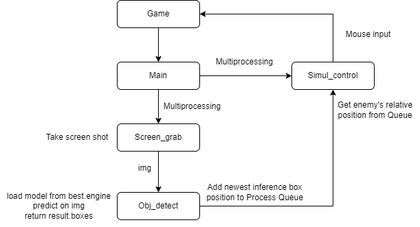

# Apex Legends Aim Assit

## Design
- ### Screen Shot: 
    Two methods are implemented: win32 api and PyQt.
    Achieve 300 FPS.
- ### Inference: 
    Using YOLOv8n. 
    Trained with custom dataset (7000+ images, 30 epo). 
    export to tensorrt ('.engine'). 'best.pt' 10ms => 'best.engine' 4ms
    Achieve 80 FPS.
- ### Simulation:
    Using pynput as listener.
    Using pydirectinput for in-game input.
    The Primary target is the one with the smallest Euclidean distance between the bounding box center and center of the screen (cursor). This approch maintain the stable of aiming. The relative distance of moving cursor is divided by aim_sensitive in order to have a adjustable aiming correctness.
  
### Game -> screen_grab -> obj_detect -> simul_control
multiprocessing: one process handles game-play inference; sencond process handles keyboard listener and mouse input in game



## Run
``` python main.py ```
main program start point. 
args: '--test' output real-time inference images with bounding boxes

``` python screen_grab.py ```
get active window. Passing window title to screen shot function could increase FPS

``` python obj_detect.py ```
single image detection and model export

``` train.ipynb ```
train YOLO model, start with pre-trained yolov8n.pt

## Performance
### Screen Shots
    Several popular python screen shots method are tested. Performance for 10 shots are listed:
        - pil time: 18.548096656799316 FPS: 0.5391388768903264
        - win32 time: 0.44801950454711914 FPS: 22.320456807139475
        - PyQt time: 0.17300081253051758 FPS: 57.80319672334479
        Both win32 and PyQt are implemented and can be switched in main program.

### Inference
    Predict on GPU achieve 15ms on average. 
    By export model to TensorRT (".engine"), the inference time is less than 4ms on average.
    
## TODO
pynput listener causing a lagging during gameplay. May due to poor CPU.
